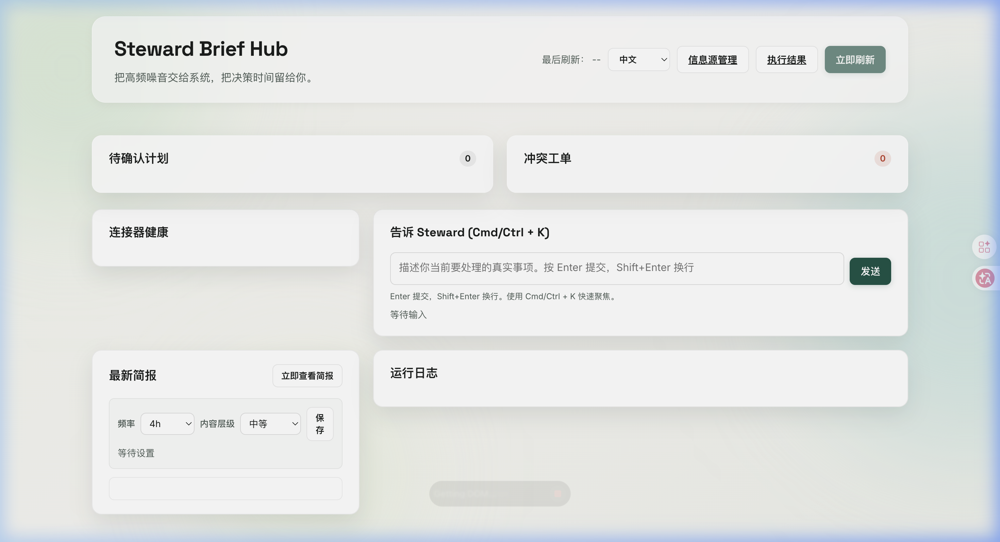
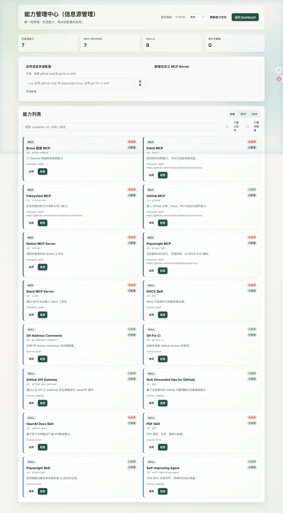

<p align="center">
  <h1 align="center">🤖 Steward</h1>
  <p align="center">
    <strong>An ambient, proactive agent that handles low-risk work automatically<br>and briefs you only when your judgment is needed.</strong>
  </p>
  <p align="center">
    <a href="./README_CN.md">中文</a> · <a href="./agent.md">Agent Spec</a> · <a href="http://127.0.0.1:8000/dashboard">Dashboard</a>
  </p>
</p>

---

## 💡 Why Steward

Picture yourself playing a grand strategy game — *Hearts of Iron* or *Civilization*. You don't want to manage "the 1st Corps is missing a rifle." You want to **set the strategy** and let the system adapt and execute based on the situation.

Your real work life is the same:

> **80% of your tasks are low-risk, automatable noise.**
> Your attention should be reserved for the **20% that truly require your judgment**.

Steward is your digital chief of staff — it silently monitors emails, GitHub, calendars, chat, and more, proactively identifies and advances your to-dos. **Low-risk tasks get done automatically. You're only interrupted for decisions that matter.**

## ✨ Key Features

| Feature | Description |
|---------|-------------|
| 🔇 **Ambient** | Runs 24/7 in the background, zero popups by default |
| 🧠 **Multi-Source Perception** | GitHub, email, calendar, chat, screen — all first-class signal sources |
| ⚡ **Autonomous Execution** | Low-risk tasks auto-completed with full audit trail and rollback capability |
| 🛡️ **Policy Gate** | High-risk / irreversible actions require explicit human approval — no override possible |
| 📋 **Periodic Briefs** | Every 4 hours: natural language summary of "what was done, what's pending, what needs your call" |
| 🔌 **Capability Hub (MCP + Skills)** | Community-first capability model with unified enable/disable/configure flow in Dashboard |
| 🧩 **Conflict Arbiter** | When multiple plans compete for the same resource: auto merge / serialize / escalate |

## 📸 Dashboard Preview

<p align="center">
  
</p>

<p align="center">
  
</p>

## 🚀 Quick Start

### 1) API/UI quick start (no Docker required)

```bash
git clone https://github.com/user/Steward.git
cd Steward
make start
```

An interactive wizard walks you through setup:

```
╔══════════════════════════════════════╗
║     🤖  Steward Quick Start         ║
╚══════════════════════════════════════╝

✅ Python: Python 3.14.2
✅ Virtual environment created
✅ Dependencies installed

📋 Configure LLM API (required)
  Select your LLM provider:
  1) OpenAI   2) DeepSeek   3) NVIDIA NIM
  4) GLM      5) Moonshot   6) Custom URL

  Enter API Key: ▎

🚀 All set! Starting Steward...
   Dashboard:  http://127.0.0.1:8000/dashboard
```

Quick Start also includes an optional capability step:
- `GitHub Agent Bundle` (recommended): enables GitHub MCP + detected local skills (`gh-address-comments`, `gh-fix-ci`, `playwright`, `gog`, `self-improving-agent`, `github-api-gateway`).
- If a skill is not installed locally, the wizard reports it and you can enable it later in `/dashboard/integrations`.
- You can also link project-local skills to Codex with `make install-skills`.

This mode is great for local exploration of API/UI and manual confirmation flows.

### 2) Full real execution mode (recommended)

To run **real asynchronous execution** (`gate_result=auto` dispatches to queue), Steward needs:

- a Redis broker
- a running worker process (`steward-worker`)

Docker is **not mandatory**. It is only the easiest way to boot Postgres + Redis locally.

```bash
# terminal A
docker compose up -d        # starts postgres + redis
make upgrade
make run

# terminal B
make worker
```

If you don't want Docker, use your local Postgres/Redis instead and set env vars accordingly.

### 3) API/UI only with execution disabled (optional)

```bash
export STEWARD_EXECUTION_ENABLED=false
make run
```

## 🔌 Capability Management (First Principles)

- Single capability model: `MCP Server + Skill` is the primary integration abstraction.
- Community-first reuse: prefer existing MCP servers and local/community skills before custom providers.
- Dashboard entry: `http://127.0.0.1:8000/dashboard/integrations`.
- Core API:
  - `GET /api/v1/integrations`
  - `POST /api/v1/integrations/nl`
  - `POST /api/v1/integrations/mcp/{server}/configure|enable|disable`
  - `POST /api/v1/integrations/skills/{skill}/configure|enable|disable`
- GitHub issue sensing:
  - Webhook callback: `POST /api/v1/webhooks/providers/github`
  - Configure webhook secret via `STEWARD_GITHUB_WEBHOOK_SECRET` (or integrations API/NL)
  - In GitHub Webhook events, enable `issues`, `issue_comment`, `pull_request`
  - Low-risk GitHub issues/comments can be silently auto-replied (no manual confirm) through `plan -> gate(auto) -> worker execute`
  - GitHub auto reply is now agentic: uses issue content + local repo context to generate bilingual replies
  - `issue_comment` loop protection: self-authored bot comments are skipped; user comments can still trigger follow-up
  - Status: currently under active prompt/policy tuning for reply quality and false-positive control
- Runtime persistence: `config/integrations.runtime.json` (`config`, `custom_providers`, `mcp_servers`, `skills`).
- Compatibility note: `/api/v1/skills` remains as a compatibility facade, backed by the same integration state.

### Security Notes (Secrets)

- Do not commit `.env` or real tokens/secrets.
- Keep only placeholders in `.env.example`.
- `config/integrations.runtime.json` is runtime state; if it contains real secrets, rotate them and keep them out of Git history.

## 📊 Execution Results Page

- Dashboard entries:
  - `http://127.0.0.1:8000/dashboard` (main)
  - `http://127.0.0.1:8000/dashboard/executions` (execution results)
- `Executions` view now includes:
  - human-readable summaries for dispatch status/trigger/step outcomes
  - bilingual rendering (`zh/en`) based on current UI language
  - direct link to open saved manual notes (`record_note`) from the page
- Core APIs:
  - `GET /api/v1/dashboard/executions?limit=50&lang=zh|en`
  - `GET /api/v1/dashboard/records/{filename}` (safe markdown record read for journal notes)

## 🏗️ Architecture

```
Signal Sources (GitHub / Email / Calendar / Screen / MCP / Skill)
         │
         ▼
   ┌─────────────┐
   │  Perception  │  ← Webhooks / Polling / Screen Sensor
   └──────┬──────┘
          │
          ▼
   ┌─────────────┐
   │ Context Space│  ← Cross-source aggregation & entity resolution
   └──────┬──────┘
          │
          ▼
   ┌─────────────┐
   │  Planner     │  ← Intent inference → single agent_execute step
   └──────┬──────┘
          │
          ▼
   ┌─────────────┐
   │ Policy Gate  │  ← Risk assessment, confidence, interruption budget
   └──────┬──────┘
          │
          ▼
   ┌────────────────┐
   │ ExecutionAgent  │  ← LiteLLM acompletion() ReAct Loop
   │  (Tool Calling) │     Think → Tool Call → Result → Think ...
   └──────┬─────────┘
          │
    ┌─────┴──────┐
    ▼            ▼
  ToolRegistry  Ask User
  (MCP/Skill)     │
    │              ▼
    ▼         ┌─────────────┐
  Execute     │ Brief & Audit│  ← NL summaries + execution logs
              └─────────────┘
```

## 🛠️ Tech Stack

| Layer | Technology |
|-------|-----------|
| Language | Python 3.14 + asyncio |
| API | FastAPI + Uvicorn |
| Data | SQLite (default) / PostgreSQL + SQLAlchemy + Alembic |
| Scheduling | APScheduler (event-driven first, polling as fallback) |
| Execution Runtime | Celery + Redis |
| Agent Engine | LiteLLM + OpenAI Tool Calling (ReAct loop) |
| Models | Any LLM via LiteLLM (DeepSeek / Claude / GPT / NVIDIA NIM / Moonshot etc.) |
| Observability | structlog + OpenTelemetry + Prometheus |

## 📁 Project Structure

```
steward/
├── api/              # FastAPI routes (REST + Webhooks)
├── planning/         # Superpowers-guided plan compilation and policy checks
├── core/             # Config, logging, model layer
├── domain/           # Enums, schemas, domain models
├── infra/            # Database, migrations
├── connectors/       # GitHub / Email / Calendar / MCP / Skill connectors
├── connectors_runtime/# Declarative connector specs + runtime validation
├── services/         # Core logic (policy gate, briefs, conflict arbiter)
├── runtime/          # Scheduler + async execution worker runtime
├── macos/            # macOS menu bar shell
├── screen_sensor/    # Cross-platform screen sensor (macOS / Windows / Linux)
└── ui/               # Dashboard frontend
```

## 📖 Learn More

- **[agent.md](./agent.md)**: The full design specification (800+ lines) — first-principles derivation of Context Space, Policy Gate, Conflict Arbiter, State Machine, personalized learning, and every other mechanism.

## 🤝 Contributing

Issues and PRs welcome. Please read [agent.md](./agent.md) first to understand the design philosophy.

```bash
make lint    # Code linting
make test    # Run tests
make format  # Code formatting
```

## 📄 License

[MIT](./LICENSE)
