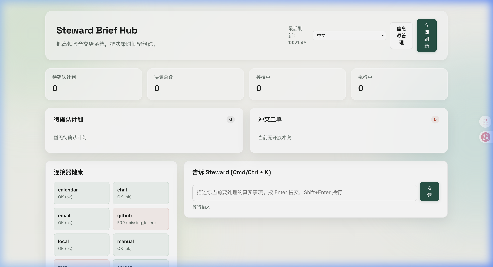
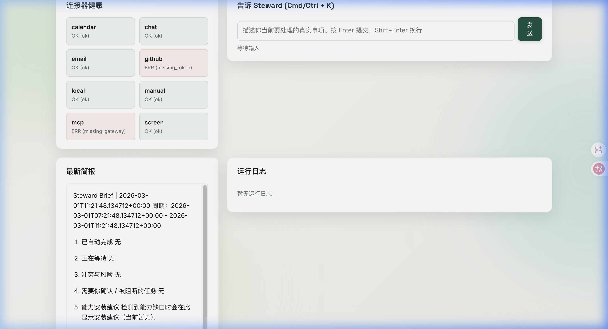
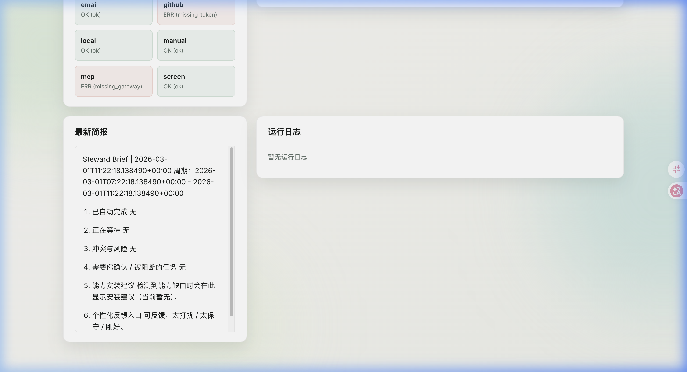

<p align="center">
  <h1 align="center">🤖 Steward</h1>
  <p align="center">
    <strong>一个无感常驻、主动推进事务的协作 Agent。</strong><br>
    把高频噪音交给系统，把决策时间留给你。
  </p>
  <p align="center">
    <a href="./README.md">English</a> · <a href="./agent.md">Agent Spec</a> · <a href="http://127.0.0.1:8000/dashboard">Dashboard</a>
  </p>
</p>

---

## 💡 为什么做 Steward

想象你在玩一款策略游戏——《钢铁雄心》或《文明》。你不想亲自管理"第一军团少了一支枪"，你想做的是**制定战略**，然后让系统根据战场态势自行执行。

现实工作中的你也是如此：

> **80% 的事务是低风险、可自动化的噪音。**
> 你的注意力应该只花在那 **20% 真正需要你判断的决策**上。

Steward 就是你的数字管家——它静默感知邮件、GitHub、日历、聊天等多源信号，主动识别并推进待办事项，**低风险的事情自动做完，只在关键决策时才打扰你**。

## ✨ 核心特性

| 特性 | 描述 |
|-----|------|
| 🔇 **无感常驻** | 7×24 后台运行，默认不弹窗，只在关键时刻打扰 |
| 🧠 **多源感知** | GitHub、邮件、日历、聊天、屏幕信号——统一接入的一等信号源 |
| ⚡ **自主执行** | 低风险任务自动完成，带审计记录和回滚能力 |
| 🛡️ **策略门禁** | 高风险/不可逆动作必须人工确认，安全底线不可配置绕过 |
| 📋 **定时简报** | 每 4 小时汇总一次，用自然语言告诉你"做了什么、等什么、需要你决定什么" |
| 🔌 **能力管理中心（MCP + Skill）** | 社区优先复用能力，在 Dashboard 内统一启用/停用/配置 |
| 🧩 **冲突仲裁** | 多任务竞争同一资源时，自动合并/串行/升级处理 |

## 📸 Dashboard 预览

<p align="center">
  
</p>

<p align="center">
  
</p>

<p align="center">
  
</p>

## 🚀 快速开始

### 1）快速体验 API/UI（不需要 Docker）

```bash
git clone https://github.com/user/Steward.git
cd Steward
make start
```

终端会交互式引导你完成配置：

```
╔══════════════════════════════════════╗
║     🤖  Steward 一键启动向导        ║
╚══════════════════════════════════════╝

✅ Python: Python 3.14.2
✅ 虚拟环境已创建
✅ 依赖安装完成

📋 配置大模型 API（必填项）
  请选择大模型供应商：
  1) OpenAI   2) DeepSeek   3) NVIDIA NIM
  4) 智谱 GLM  5) Moonshot   6) 自定义 URL

  请输入 API Key: ▎

🚀 一切就绪！正在启动 Steward...
   Dashboard:  http://127.0.0.1:8000/dashboard
```

该模式适合本地体验 API/UI 和人工确认流程。

### 2）完整真实执行模式（推荐）

若要开启**真实异步执行**（`gate_result=auto` 进入队列执行），Steward 需要：

- Redis（消息队列/结果后端）
- worker 进程（`steward-worker`）

Docker **不是必须**，只是本地同时拉起 Postgres + Redis 的最省事方式。

```bash
# 终端 A
docker compose up -d        # 启动 postgres + redis
make upgrade
make run

# 终端 B
make worker
```

如果你不用 Docker，也可以使用本机/远程的 Postgres、Redis，并通过环境变量配置。

### 3）仅 API/UI（关闭执行引擎，可选）

```bash
export STEWARD_EXECUTION_ENABLED=false
make run
```

## 🔌 能力配置（第一性原理）

- 单一能力模型：`MCP Server + Skill` 是主接入抽象。
- 社区优先：优先复用社区 MCP 与本地/社区 Skill，再考虑自定义 Provider。
- Dashboard 入口：`http://127.0.0.1:8000/dashboard/integrations`。
- 核心接口：
  - `GET /api/v1/integrations`
  - `POST /api/v1/integrations/nl`
  - `POST /api/v1/integrations/mcp/{server}/configure|enable|disable`
  - `POST /api/v1/integrations/skills/{skill}/configure|enable|disable`
- GitHub Issue 感知：
  - Webhook 回调地址：`POST /api/v1/webhooks/providers/github`
  - 通过 `STEWARD_GITHUB_WEBHOOK_SECRET`（或 integrations API/NL）配置密钥
  - 在 GitHub Webhook 事件里勾选 `issues`、`issue_comment`、`pull_request`
  - GitHub 自动回复已改为 agent 化：结合 issue 内容 + 本地仓库上下文生成中英双语回复
  - `issue_comment` 防循环：仅跳过 bot 自己发出的评论；用户评论仍可触发后续回复
- 运行时持久化：`config/integrations.runtime.json`（`config`、`custom_providers`、`mcp_servers`、`skills`）。
- 兼容说明：`/api/v1/skills` 仅作为兼容层，底层状态与 integrations 共用同一来源。

### 安全说明（密钥）

- 不要提交 `.env` 或任何真实 token/secret。
- `.env.example` 仅保留占位示例。
- `config/integrations.runtime.json` 属于运行时状态；若含真实密钥，请先轮换并避免进入 Git 历史。

## 📊 执行结果页面

- Dashboard 入口：
  - `http://127.0.0.1:8000/dashboard`（主面板）
  - `http://127.0.0.1:8000/dashboard/executions`（执行结果）
- `执行结果`页面当前支持：
  - 状态/触发原因/步骤结果的人话展示
  - 中英文双语渲染（随页面语言切换）
  - 对 `record_note` 自动保存记录提供“打开记录”入口
- 相关接口：
  - `GET /api/v1/dashboard/executions?limit=50&lang=zh|en`
  - `GET /api/v1/dashboard/records/{filename}`（安全读取 journal markdown 记录）

## 🏗️ 架构概览

```
信号源 (GitHub / 邮件 / 日历 / 屏幕 / MCP / Skill)
         │
         ▼
   ┌─────────────┐
   │  感知入口    │  ← Webhook / 轮询 / 屏幕传感器
   └──────┬──────┘
          │
          ▼
   ┌─────────────┐
   │ Context Space│  ← 跨源信号聚合、实体解析
   └──────┬──────┘
          │
          ▼
   ┌─────────────┐
   │  策略门禁    │  ← 风险评估、置信度、打扰预算
   └──────┬──────┘
          │
          ▼
   ┌─────────────┐
   │ 异步分发层   │  ← Celery + Redis
   └──────┬──────┘
          │
     ┌────┴────┐
     ▼         ▼
  Worker 执行  请求确认
     │         │
     ▼         ▼
   ┌─────────────┐
   │  简报 & 审计 │  ← 自然语言总结 + 执行尝试日志
   └─────────────┘
```

## 🛠️ 技术栈

| 层 | 技术 |
|---|------|
| 语言 | Python 3.14 + asyncio |
| 服务层 | FastAPI + Uvicorn |
| 数据层 | SQLite（默认）/ PostgreSQL + SQLAlchemy + Alembic |
| 调度 | APScheduler（事件驱动优先，轮询兜底） |
| 执行运行时 | Celery + Redis |
| 模型 | OpenAI 兼容 API（任意供应商） |
| 可观测性 | structlog + OpenTelemetry + Prometheus |

## 📁 项目结构

```
steward/
├── api/              # FastAPI 路由（REST + Webhook）
├── planning/         # 基于 Superpowers 资产的计划编译与执行规则校验
├── core/             # 配置、日志、模型层
├── domain/           # 枚举、Schema、领域模型
├── infra/            # 数据库、迁移
├── connectors/       # GitHub / Email / Calendar / MCP / Skill 连接器
├── connectors_runtime/# 声明式连接器规格 + 运行时校验
├── services/         # 核心业务逻辑（门禁、简报、冲突仲裁）
├── runtime/          # 调度器 + 异步执行运行时
├── macos/            # macOS 托盘壳层
├── screen_sensor/    # 跨平台屏幕传感器（macOS / Windows / Linux）
└── ui/               # Dashboard 前端
```

## 📖 深入了解

- **[agent.md](./agent.md)**：完整的设计规范（800+ 行），涵盖 Context Space、策略门禁、冲突仲裁、状态机、个性化学习等所有机制的第一性原理推导。

## 🤝 贡献

欢迎提交 Issue 和 PR。请先阅读 [agent.md](./agent.md) 了解设计理念。

```bash
make lint    # 代码检查
make test    # 运行测试
make format  # 代码格式化
```

## 📄 License

[MIT](./LICENSE)
